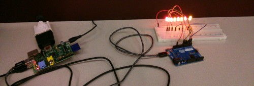

#PingCanal#
##Version 0.1##

Neato Python and Arduino project that tells you the status of the Welland Canal Bridges.  LEDs on if the bridge is available, LED off if the bridge is up.  Scrapes data from [http://greatlakes-seaway.com/R2/jsp/R2.jsp?language=E&loc=NiaBrdgStatus.jsp](http://greatlakes-seaway.com/R2/jsp/R2.jsp?language=E&loc=NiaBrdgStatus.jsp)

Cooked up for the Inaugural [BrockHackFest](http://brocku.ca/news/26671) Winner of the [Klick](https://twitter.com/arlabrat/statuses/492762428493414401) grand prize. W00t
